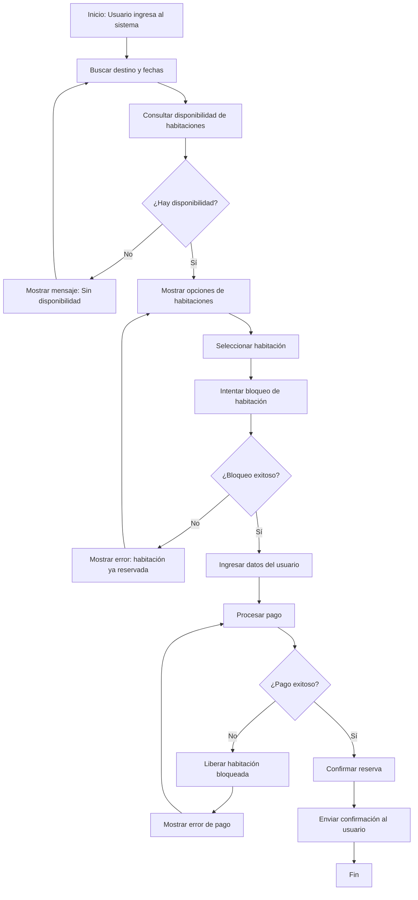

# PRD: 🏨 Travel: Motor de Reservas de Hotel (MVP NestJS + React)

## 1. Visión

Este MVP implementa un motor de reservas de hotel centrado en la lógica de negocio crítica: verificar disponibilidad en tiempo real, bloquear una habitación específica por 10 minutos durante el check-out y confirmar la reserva solo tras un pago simulado exitoso.

El sistema prioriza la consistencia del inventario con un manejo de concurrencia simple, evitando dobles reservas mediante bloqueo pesimista (transacción + `SELECT ... FOR UPDATE`) y una expiración automática de bloqueos (un estimado de 10 minutos). El frontend (React) expone un flujo de búsqueda → selección → check-out con contador regresivo visible y notificaciones de estado.

No se incluye autenticación ni administración avanzada; los datos iniciales (hotel/habitaciones/tarifas básicas) se cargan vía seeder.

## 2. Alcance (IN/OUT)

### 2.1 Business goals

- Reducir el riesgo de sobreventa (double booking) a ~0 en el flujo MVP.
- Incrementar conversión al proteger inventario durante el pago (hold de 10 minutos).
- Liberar automáticamente inventario bloqueado para evitar pérdida de ventas.

### 2.2 User goals

- Permitir al viajero seleccionar una habitación y completar el pago con la tranquilidad de que la habitación permanecerá bloqueada durante 10 minutos.
- Dar visibilidad clara del tiempo restante de bloqueo en el check-out.
- Permitir al administrador del hotel recuperar inventario automáticamente cuando el pago no se completa.

### 2.3 Non-goals

- Cancelaciones, cambios de fecha, reembolsos o políticas de penalidad.
- Registro/login, perfiles, programas de lealtad.
- Multidivisa o integración con pasarelas reales.
- Panel de administración, reportes históricos avanzados.

## 3. User personas

### 3.1 Key user types

- Viajero (huésped)
- Administrador del hotel

### 3.2 Basic persona details

- **Viajero (huésped)**: busca una habitación disponible, la bloquea durante el check-out y completa el pago dentro de un límite de tiempo, con confirmación inmediata.
- **Administrador del hotel**: necesita que el inventario no quede “secuestrado” por bloqueos abandonados; requiere liberación automática y consistencia del estado.

### 3.3 Role-based access

- **Viajero (sin login)**: acceso público a búsqueda, selección, check-out, pago simulado y confirmación.
- **Administrador del hotel (sin login en MVP)**: necesidades cubiertas indirectamente por la lógica automática de expiración; no hay UI ni endpoints protegidos de administración.

## 4. Functional requirements

- **Buscador de disponibilidad atómico** (Priority: P0)
  - Consultar disponibilidad por rango de fechas para habitaciones específicas.
  - La disponibilidad debe descontar:
    - Reservas confirmadas.
    - Bloqueos temporales activos (holds) no expirados.
  - Si una habitación está bloqueada/confirmada para cualquier fecha del rango solicitado, debe aparecer como no disponible para ese rango.

- **Bloqueo pesimista de check-out (10 minutos)** (Priority: P0)
  - Al seleccionar una habitación y rango de fechas, el sistema debe intentar crear un hold.
  - El hold debe crear un “bloqueo temporal” con `expires_at = now() + 10 minutos`.
  - El proceso de creación del hold debe ser atómico y seguro ante concurrencia.
  - En la capa de persistencia, se debe usar transacción y `SELECT ... FOR UPDATE` (o equivalente) para evitar que dos holds/reservas se creen simultáneamente para la misma habitación/rango.

- **Expiración automática de bloqueos** (Priority: P0)
  - Un worker/proceso programado debe liberar holds expirados sin pago.
  - Un hold expirado debe transicionar a un estado final (por ejemplo `EXPIRED`) y dejar la habitación disponible.
  - La expiración debe ser idempotente (ejecutar dos veces no debe romper estados).

- **Pago simulado e idempotente** (Priority: P0)
  - La “pasarela” debe ser mock/simulador con resultado configurable (éxito/fallo).
  - Se deben soportar claves de idempotencia por intento de pago para evitar cobros duplicados (p. ej. reintentos del cliente).
  - Un pago solo puede confirmar una reserva si existe un hold activo y no expirado.
  - Pago fallido debe liberar el hold (o marcarlo como `CANCELLED/RELEASED`) inmediatamente.

- **Confirmación de reserva** (Priority: P0)
  - Tras pago exitoso, se debe crear una reserva confirmada vinculada a la habitación y al rango de fechas.
  - El hold debe transicionar a `CONFIRMED` (o cerrarse) y no volver a liberar inventario.
  - Se debe presentar una pantalla de confirmación (número/código de reserva).

  - **UI con contador regresivo de 10 minutos** (Priority: P0)
  - Al entrar al check-out, el usuario ve el tiempo restante del hold.
  - Al llegar a 0, el flujo debe bloquear el pago y guiar al usuario a reintentar (por ejemplo, volver a seleccionar).
  - La UI debe sincronizar su estado con el backend (no confiar solo en el reloj del cliente).

- **Seeder de datos** (Priority: P1)
  - Carga inicial de hotel(es), habitaciones (por ID único) y tarifas básicas para permitir pruebas end-to-end.
  - La creación de datos de prueba no requiere UI.

## 5. User experience

### 5.1 Entry points & first-time user flow

- Landing simple con buscador (fechas + ciudad/hotel opcional) y listado de habitaciones disponibles.
- Selección de una habitación específica inicia el hold y redirige a check-out.
- Check-out muestra datos mínimos, contador y botón “Pagar (simulado)”.

### 5.2 Core experience

- **Buscar habitaciones**: el usuario ingresa fecha de entrada/salida y ve habitaciones disponibles.
  - Asegura transparencia al mostrar solo inventario realmente disponible (descuenta holds activos).
- **Seleccionar habitación**: al elegir, el sistema crea un hold de 10 minutos o responde “no disponible”.
  - Asegura consistencia usando bloqueo pesimista ante concurrencia.
- **Check-out con timer**: el usuario completa datos básicos y ve el contador.
  - Asegura claridad del estado temporal del inventario.
- **Pagar (mock)**: el usuario confirma y el backend procesa pago idempotente.
  - Evita cobro/reserva duplicada por reintentos.
- **Confirmación**: se muestra el estado final (confirmado) con código de reserva.
  - Asegura cierre de transacción de negocio.

  ### 5.3 Advanced features & edge cases

- Dos usuarios intentan bloquear la misma habitación/rango casi al mismo tiempo.
- Usuario refresca la página durante el hold: la UI debe recuperar el estado del hold.
- Usuario intenta pagar después de que el hold expiró.
- Reintento de pago por timeout de red: se debe aplicar idempotencia.
- Pago fallido: el hold se libera inmediatamente.
- Worker cae temporalmente: los holds expirados deben liberarse al reanudarse el worker (eventual consistency acotada).

### 5.4 UI/UX highlights

- “Transparencia de disponibilidad”: el listado refleja inventario real.
- Timer visible con tiempo restante del hold.
- Mensajes claros en “No disponible”, “Hold expirado” y “Pago fallido”.

### 5.5 Flujo de Reserva de Hotel (Usuario Viajero)

## 6. Narrative

El viajero busca fechas y elige una habitación específica. Al seleccionarla, el sistema la bloquea durante 10 minutos para que el viajero pueda completar el check-out con seguridad. Si el pago simulado se confirma dentro del tiempo, la reserva queda confirmada; si no, el sistema libera la habitación automáticamente para que otros usuarios puedan reservarla, manteniendo el inventario siempre vendible.

---

## 7. Suposiciones, Riesgos y Preguntas Abiertas
* **Suposiciones:** Se asume que 10 minutos es el tiempo suficiente para el 95% de los usuarios para completar el pago.
* **Riesgos Técnicos:** Saturación de la tabla de disponibilidad bajo alto volumen de bloqueos simultáneos.
* **Riesgos de Negocio:** Usuarios malintencionados bloqueando inventario sin intención de compra (DoS de inventario).
* **Preguntas Abiertas:** ¿Se debe permitir extender el timer si el usuario está interactuando activamente con el formulario?

---

## 8. Success metrics

### 8.1 User-centric metrics

- Tasa de éxito de creación de hold (selección) sin errores.
- Tiempo medio desde selección hasta confirmación.
- Porcentaje de holds que expiran (indicador de fricción del check-out).

### 8.2 Business metrics

- Overbooking: 0 reservas confirmadas duplicadas por habitación/rango.
- Conversión: confirmaciones / holds creados.
- Recuperación de inventario: holds expirados liberados / total holds expirados.